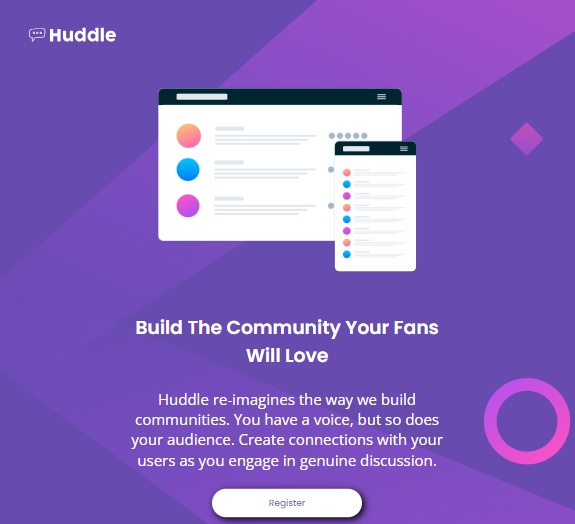
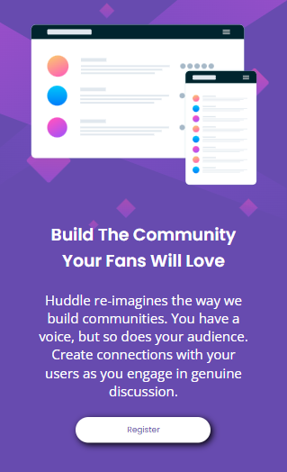

# Huddle landing page com uma única seção introdutória
Este projeto é uma seção introdutória de uma Landing Page, uma Quest do curso DevQuest, desenvolvido pelo Dev em Dobro. Esse projeto tem como base um desafio do [Frontend Mentor](https://www.frontendmentor.io/challenges/huddle-landing-page-with-a-single-introductory-section-B_2Wvxgi0).

# Tecnologias utilizadas
- HTML;
- CSS.

# Interações com a página
O logo da página é clicável, mas não tem mudança visual.

Os botões "Register" e das redes sociais são clicáveis e mudam de cor de forma suave.

# Responsividade
O projeto ficou responsivo em tablet(768px).

O projeto ficou responsivo em mobile(375px).

